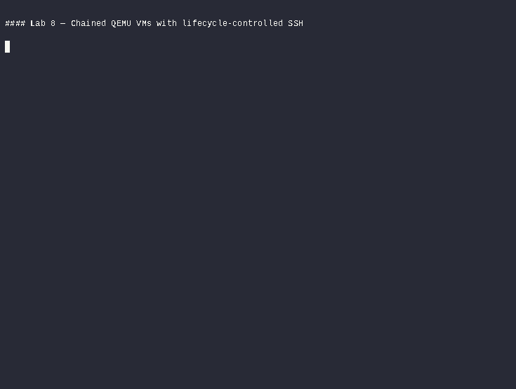
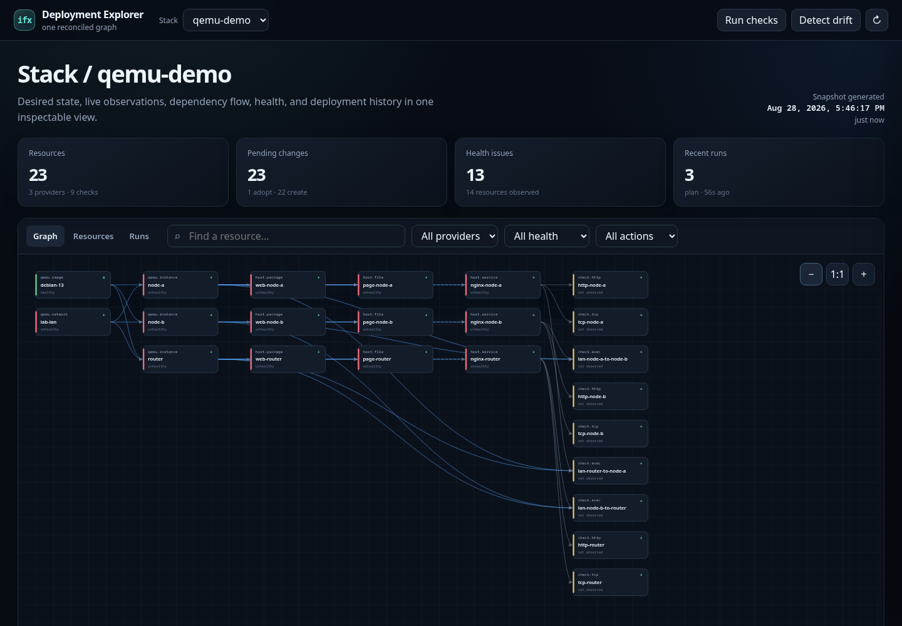

<p align="center">
  
</p>

<h1 align="center">ifx</h1>

<p align="center"><strong>Infrastructure as one reconciled graph.</strong></p>
<p align="center"><code>DECLARE · RECONCILE · PROVE</code></p>

ifx plans cloud resources, local virtual machines, host configuration, and the checks
that prove the result as one dependency graph. A reference such as `vm.connection()`
carries both a value and an ordering edge: create the VM before configuring it, and
delete it after its files, packages, and services.

Rust is the production stack language. The lightweight `ifx-program` crate supplies generated,
typed builders. `ifxd` watches and compiles configured stack roots, emits immutable
Program revisions, validates them, and owns every provider operation. The `ifx` CLI is a
control-plane client; it never executes a stack or provider locally.

The experimental [IFX DSL and LSP](docs/language.md) now provide fluent declarations,
typed local modules and ordered configuration lambdas. `ifx-lang` checks/compiles
them locally and tests configuration against an in-memory host; real host execution
and integration into `burn` remain separate work. A separate
[language design draft](docs/language-next.md) explores functions, structs,
constructors and explicit returns; its examples are not yet executable.

| Declare | Reconcile | Prove |
|---|---|---|
| Write a typed Rust program. | Observe providers and hosts, then apply one graph-ordered diff. | Put checks in the graph and inspect build, health, drift, and run history through `ifxd`. |

## Start locally

Build the client, daemon, and Rust lab runner:

```console
$ cargo build -p ifx-cli -p ifxd -p ifx-labs
$ cargo run -p ifx-labs -- run 1
```

Lab 1 needs no account or root access. The runner starts an isolated daemon, waits for
its background compiler, applies the stack, proves idempotence, and destroys it.

The primary local integration target is Lab 8. It downloads and verifies one Debian
cloud image, creates three qcow2 overlays, joins the guests as a two-link router → middle
→ leaf chain, removes transitional direct SSH access, configures nginx through the final
nested SSH paths, checks host-to-guest and guest-to-guest traffic, then
tears the guests down while retaining the verified image cache:

```console
$ cargo run -p ifx-labs -- run 8
```

QEMU, `qemu-img`, `ssh-keygen`, and either `cloud-localds`, `genisoimage`, or `xorriso`
are required. KVM is used when available; otherwise the provider falls back to TCG.

[](labs/casts/lab-8.cast)

*The preview is narrated at human pace. Click it for the asciinema cast.*

## A stack is a Rust program

The schema is the source of truth for these builders, input types, defaults, replacement
rules, sensitive fields, and typed outputs.

```rust
use std::process::ExitCode;

use ifx_program::host;
use ifx_program::emit_program;

const DEFAULT_IMAGE_URL: &str =
    "https://cloud.debian.org/images/cloud/trixie/example/debian.qcow2";
const DEFAULT_IMAGE_SHA256: &str = "replace-with-the-pinned-sha256";

fn main() -> ExitCode {
    emit_program(|stack, context| {
        let root: String = context.config("lab_dir")?;
        let image_url: String = context
            .config_optional("image_url")?
            .unwrap_or_else(|| DEFAULT_IMAGE_URL.to_string());
        let image_sha256: String = context
            .config_optional("image_sha256")?
            .unwrap_or_else(|| DEFAULT_IMAGE_SHA256.to_string());

        let image = stack
            .qemu_image("debian")
            .url(image_url)
            .sha256(image_sha256)
            .dir(&root)
            .add()?;

        let lan = stack
            .qemu_network("lan")
            .name("demo")
            .dir(&root)
            .add()?;

        let vm = stack
            .qemu_instance("web")
            .dir(&root)
            .image(image.path())
            .networks([lan.endpoint()])
            .add()?;

        let packages = stack
            .host_package("nginx")
            .on(vm.connection())
            .names(["nginx"])
            .add()?;

        let page = stack
            .host_file("page")
            .on(vm.connection())
            .path("/var/www/html/index.html")
            .content("<h1>hello from ifx</h1>\n")
            .privileged(true)
            .depends_on(&packages)
            .add()?;

        stack
            .host_service("nginx")
            .on(vm.connection())
            .name("nginx")
            .enabled(true)
            .state(host::ServiceState::Running)
            .triggered_by(&page)
            .add()?;

        Ok(())
    })
}
```

A standalone stack contains `Cargo.toml`, `Cargo.lock`, `src/main.rs`, and `ifx.toml`.
`ifxd` must explicitly configure its directory as a trusted authoring root:

```toml
# ifx.toml
name = "demo"
file = "Cargo.toml"

[config]
lab_dir = "/tmp/ifx-demo"
```

```console
$ ifxd --db surrealkv://$PWD/.ifx/db --stack "$PWD=default" &
$ ifx build
$ ifx plan
$ ifx apply -y
$ ifx graph --format html --out deployment.html
$ ifx status
$ ifx destroy -y
```

`ifx build` manually retries immediately. Ordinarily the daemon notices stack, local
path dependency, workspace/lock, Cargo configuration, toolchain, and `ifx.toml` edits
every 250 ms and builds in the background. Each event—or scan failure—marks the previous
Program stale before compilation starts. Plan, apply, refresh, drift, and graph
resolution fail closed until the current generation is ready; health checks may
continue against deployed state.

## Deployment Explorer

Open `http://127.0.0.1:7433/` for the live graph, or export a self-contained document:

```console
$ ifx graph --format html --out deployment.html
```

The Explorer shows desired and observed properties, reference/dependency/trigger edges,
pending actions, health, durable runs, source generation, build duration, diagnostics,
and revision freshness. Layouts shape the same graph by build dependency, declared
resource utilization, logical/physical layer, human/computer-facing surface, provider,
health, or lifecycle action.

[](docs/images/deployment-explorer-graph.png)

## Providers

| Types | Purpose |
|---|---|
| `qemu.image`, `qemu.volume`, `qemu.network`, `qemu.instance` | Verified images, durable disks, rootless networks, and local VMs |
| `linode.instance`, `linode.firewall`, `linode.domain`, `linode.domain_record` | Linode compute, firewall, and DNS resources |
| `host.file`, `host.package`, `host.service`, `host.exec`, `host.user` | Local or SSH host configuration |
| `check.http`, `check.tcp`, `check.exec` | Apply-time and continuously monitored checks |
| `memory.value` | Small stateful resource used by examples and tests |

Run `ifx schema` for installed types or read the generated
[resource reference](docs/resources.md).

## Operational model

- `ifxd` is the compiler, execution, persistence, retry, approval, and observation
  boundary.
- Only administrator-configured local stack roots are compiled; clients cannot upload
  source paths or submit arbitrary Program revisions.
- Compiled emitters are configuration-independent. Configuration-only runs emit a new
  content-addressed Program without invoking Cargo.
- All stacks share one locked, garbage-collected Cargo target cache. It defaults to
  `$XDG_CACHE_HOME/ifx/rust` or `~/.cache/ifx/rust` and can be moved with
  `IFX_CACHE_DIR`; stable runtime copies live under each stack's `.ifx/build`.
- Program revisions, state, execution events, approvals, recovery journals, health, and
  drift history are stored through the daemon's SurrealDB-backed store.
- Manual retry wakes execution backoff immediately; unattended retries retain capped
  exponential backoff.

## Documentation

| Guide | Purpose |
|---|---|
| [Getting started](docs/getting-started.md) | Build, run, and understand the first stack |
| [Labs](labs/README.md) | Executable, narrated learning sequence |
| [Rust stack authoring](labs/07-rust-program/README.md) | Builders, configuration, references, components, and iteration |
| [CLI](docs/cli.md) | Commands, configuration, exit codes, and state operations |
| [`ifxd`](docs/ifxd.md) | Continuous builds, revisions, runs, security, and API |
| [Daemon brokering](docs/brokering.md) | Scoped lifecycle delegation without sharing upstream credentials |
| [QEMU](docs/qemu.md) | Images, volumes, networks, instances, lifecycle, and prerequisites |
| [Linode](docs/linode.md) | Compute, firewall, DNS, and lifecycle coverage |
| [Provider authoring](docs/provider-authoring.md) | Handler lifecycle, schemas, generation, and tests |
| [Design](docs/design.md) | Graph, compilation, reconciliation, and persistence model |
| [Troubleshooting](docs/troubleshooting.md) | Build, daemon, SSH, QEMU, state, and database failures |
| [Performance](docs/performance.md) | Cold/warm/edit, stack-size, QEMU, cache, and binary measurements |

The documentation website is in [`website/`](website/README.md). It is dark-mode only
and syncs these Markdown sources into the published handbook.

## Development

```console
$ cargo fmt --all --check
$ cargo clippy --workspace --all-targets --locked -- -D warnings
$ cargo run -p ifx-gen --locked -- --check
$ cargo test --workspace --locked
$ cargo run -p ifx-labs -- docs
```

All standalone labs and examples are checked with their committed lockfiles. The
repository contains no alternate stack runtime or language-specific package.

Licensed under Apache-2.0 or MIT.
