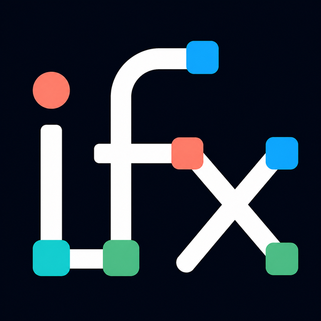

# ifx brand guide

ifx treats infrastructure, host configuration, and verification as one reconciled
graph. The identity should make that idea visible before it has to explain it.

## Name and positioning

Write the project name as lowercase **ifx**, except where a sentence or platform forces
another form. Do not expand it into an invented acronym.

The primary descriptor is:

> Infrastructure as one reconciled graph.

The three-beat action line is:

> DECLARE · RECONCILE · PROVE

Use the descriptor to explain what ifx is. Use the action line when a short visual or
tutorial needs to communicate the workflow.

## Mark

The lowercase `i`, `f`, and `x` are assembled from resource nodes and dependency
paths. The letters remain individually recognizable while one continuous path joins
them: infrastructure, configuration, and checks participate in one lifecycle.

The canonical raster asset is [`docs/assets/ifx-mark.png`](assets/ifx-mark.png). It has
a dark navy background and enough internal margin to work as an avatar, documentation
masthead, or social preview. Keep the complete square; do not crop individual letters,
recolor the paths, add a container shape, or place text over the mark.

When the mark appears next to a title, write `ifx` as live text rather than baking the
word into another image. This keeps the name sharp, searchable, and accessible.

## Color

| Role | Hex | Use |
|---|---|---|
| Night | `#080c14` | Mark and Explorer background |
| Panel | `#101722` | Surfaces and code-adjacent panels |
| Paper | `#edf4fb` | Primary text and structural paths |
| Teal | `#68e0cf` | Primary accent and connected resources |
| Blue | `#55a7ff` | Infrastructure and navigation |
| Green | `#69d391` | Healthy state and successful checks |
| Coral | `#ff6b7d` | Attention, drift, and destructive actions |

Color must not be the only status signal. Pair it with an icon, word, line style, or
shape, especially in topology and health views.

## Typography

Documentation uses the reader's system sans-serif and monospace fonts. Product UI
should prefer a compact system sans-serif for labels and a system monospace face for
URNs, property names, commands, hashes, and timestamps. Avoid adding a web-font
dependency solely for branding.

## Voice

ifx sounds calm, exact, and operational. Lead with the outcome, name the observed
state, and make risk visible. Prefer “the plan detected drift in `content`” to “an
error occurred.” Tutorials explain why a command runs and what the reader should
notice in its output.

Use concrete terms from the model—resource, reference, dependency, observation,
desired state, drift, health—without turning every paragraph into engine jargon.

## Terminal demonstrations

Every published cast should feel like a competent human teaching at the keyboard:

- introduce each command group with visible `#` commentary;
- explain why the command runs and what matters in its output;
- retain pauses long enough to read both narration and results;
- record from a reset, disposable lab and verify exit codes first;
- generate the GIF from the same complete cast rather than editing a faster preview.

The executable source of truth for pacing and narration is
[`crates/ifx-labs`](../crates/ifx-labs). Recording instructions and the complete inventory live
in the [labs guide](../labs/README.md#recordings-and-previews).

## Asset provenance

The mark was generated with OpenAI's image-generation tool from a project-specific
brief, then cropped and resized for repository use. The prompt asked for lowercase
`i`, `f`, and `x` built from one connected infrastructure graph, using the Deployment
Explorer palette on a solid night background. The generated source is retained in the
local generation workspace; the optimized canonical asset is committed here.
