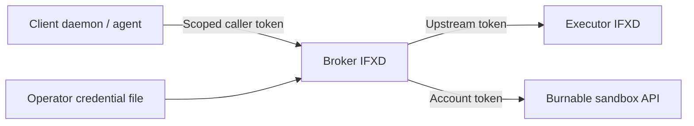

# Brokered daemon calls

**Current implementation:** this is an operator-configured whole-stack delegation
API. It is not the planned managed provider boundary described below.

## Planned managed provider boundary

Rust `burn` will compile and execute the IFX graph locally. Host functions, files,
commands, checks and SSH use the customer machine's local runtime and keys. Local
cloud handlers will proxy typed resource operations to managed IFXD.

Managed IFXD will hold provider credentials, validate account/stack/resource
ownership, funds and leases, and invoke API-only adapters (Linode first). Its
build must exclude the compiler, executor, host providers and SSH transports. It
will accept no full Program, source, connection object, command, arbitrary URL or
provider plugin. Responses contain safe resource/address facts; the local adapter
constructs SSH connections. Initial cloud scope excludes startup scripts/user
data and console commands; authorized SSH public keys are allowed input data.

Cloud inventory, idempotent operation receipts and leases remain authoritative
on the service. An independent provider-only reaper must continue cleanup after
the customer disconnects. The website will use that same authority for cloud
allocation and teardown; host setup remains a local `burn` action.

This is target design, not an available mode or protocol. Required work is ordered:
transport-free typed contract; Linode API-only extraction; managed authority and
durable operations; local IFX CLI integration; independent cleanup; website/live
integration. Exact new routes and wire types are not yet defined. Existing calls
and tokens below retain their current meaning. Credential custody does not mean
the managed daemon is unable to read its provider key.

## Existing operator broker

An IFXD broker holds an upstream credential and performs explicitly granted calls
for a client daemon or agent. The client receives its own scoped token, never the
upstream token. This is a separate mode: the broker cannot compile or execute local
stacks, and does not expose the ordinary executor/admin API.



The broker still sees its upstream bearer credential in memory; this is credential
custody, not hardware-backed signing or protection from compromise of the broker.
The upstream verifies that credential. Untrusted clients never receive it.

## Configure a target and grant

```toml
listen = "127.0.0.1:7434"

[[brokers]]
name = "research"
backend = "ifxd"
url = "https://executor.example.net"
token_file = "/run/credentials/ifxd-broker.service/executor-token"

[[brokers.stacks]]
name = "lab"
remote = "tenant-owned-lab"

[[brokers.grants]]
name = "laptop"
token_sha256 = "REPLACE_WITH_LOWERCASE_SHA256_DIGEST"
stacks = ["lab"]
operations = ["status", "plan", "ignite", "extinguish"]
expires_at = "2026-10-01T00:00:00Z"
```

The upstream stack must already be operator-registered with a prepared revision.
Use `require_lease = true` on that executor for leased infrastructure. The broker
cannot build source, resolve client configuration, supply approvals, change leases,
or replace state. Any trusted source and provider credentials live on the executor.

Generate a caller token without printing the token itself:

```sh
python3 - <<'PY'
import hashlib, os, secrets
token = secrets.token_urlsafe(32)
with os.fdopen(os.open('caller.token', os.O_WRONLY | os.O_CREAT | os.O_EXCL, 0o600), 'w') as file:
    file.write(token + '\n')
print(hashlib.sha256(token.encode()).hexdigest())
PY
```

Put that digest in the grant and transfer `caller.token` privately to the caller.
Choose the expiry explicitly. Removing a grant or rotating credential files takes
effect after restarting the broker; expiry is checked on every request. Restart to
revoke immediately rather than relying on an old process to reload configuration.
In-flight operations can complete after a grant expires or is revoked.

Start with `ifxd --config broker.toml`. Do not supply `IFXD_TOKEN`, `--token`, or
`[[stacks]]` in broker mode. The listener must be loopback; expose it through a
trusted TLS endpoint if callers are on another machine. Upstreams require HTTPS,
except literal loopback IP addresses for local testing. Credential paths are
resolved relative to the config file and read once at startup. Keep these files
private to the broker's service identity; systemd credential files are suitable.

## Call the broker

```
POST /api/v1/brokers/{target}/stacks/{binding}/{operation}
Authorization: Bearer <caller-token>
```

Requests have **no body or query parameters**. Target and binding are configured
aliases; the client cannot provide an upstream URL, remote stack name, credential,
HTTP method, header, config, file, command, or program.

For the configuration above, a local test client can inspect `research/lab`:

```sh
python3 - <<'PY'
from pathlib import Path
from urllib.request import Request, urlopen
token = Path('caller.token').read_text().strip()
request = Request('http://127.0.0.1:7434/api/v1/brokers/research/stacks/lab/status',
                  method='POST', headers={'Authorization': 'Bearer ' + token})
with urlopen(request, timeout=20) as response:
    print(response.read().decode())
PY
```

| Operation | IFXD upstream call | Meaning |
|---|---|---|
| `status` | `GET /api/stacks/{remote}` | Resource count and health enum only |
| `plan` | `POST /api/v1/stacks/{remote}/runs`, kind `plan` | Accept a durable planning run |
| `ignite` | Same run endpoint, kind `apply` | Accept an apply of the prepared revision |
| `extinguish` | Same run endpoint, kind `destroy` | Accept destruction, subject to executor policies |

The response projects only target/binding, operation, a known state, and applicable
counts, run ID or numeric quote fields. Raw diagnostics, resource outputs, state,
approvals, headers and error bodies are not returned. HTTP `202` and `queued`,
`approval_wait` or `recovery_wait` mean accepted/waiting, not completed effects.
The current broker does not expose run event streams or approvals; an operator
follows those on the executor. The ordinary `ifx --daemon` client protocol is not
rewritten by this endpoint: daemon integrations call this narrow API explicitly.

There are no automatic retries. A network error after a native IFXD mutation may
have an unknown outcome; inspect the executor before retrying. No IFXD idempotency
key is invented by the broker. Caller-supplied headers, proxy environment settings
and redirects are never forwarded/followed. At most 16 calls run concurrently;
request bodies time out after two seconds, upstream requests after 15 seconds,
and upstream JSON is bounded to 1 MiB. Logs record aliases, grant name and action,
not tokens, payloads or upstream errors.

## Burnable sandbox adapter

`backend = "burnable_sandbox"` targets the website's existing simulated stack API.
There is no production BURND daemon or live provisioning adapter in this change.
In addition to the common fields, configure `account_id` as the actual account UUID,
use a fresh UUIDv4 as the binding's `remote`, and pin its manifest:

```toml
# Inside a [[brokers]] entry:
backend = "burnable_sandbox"
account_id = "11111111-1111-4111-8111-111111111111" # replace

[[brokers.stacks]]
name = "lab"
remote = "22222222-2222-4222-8222-222222222222" # fresh deployment UUID
manifest = { package = "burnable-linode-v1", name = "lab", hours = 4, budget = "1.00", resources = [{ name = "shell", kind = "linode.instance", plan = "g6-nanode-1", region = "us-east" }] }
```

The adapter verifies the upstream token's account ID and sandbox flag before every
operation. It calls `/api/stacks/plan`, `/api/stacks`, or `/api/stacks/{remote}` with
the operator-pinned manifest and request UUID. The Burnable service independently
validates its resource scope, authorization, funds, fuse, and idempotency.

A binding is **one deployment**, not a reusable deployment name. Repeating ignite
uses the same request UUID and cannot charge twice. After extinguishing, it returns
the existing extinguished deployment; it does not resurrect resources. Configure
a fresh binding/UUID and an explicit grant for another deployment.

Arbitrary custom stacks, daemon-to-daemon broker chains, one-time grants, dynamic
account linking, live BURND integration and general credential forwarding are
outside this initial API. Key custody is only one boundary; each upstream must
still enforce its resource, billing and execution policies.
